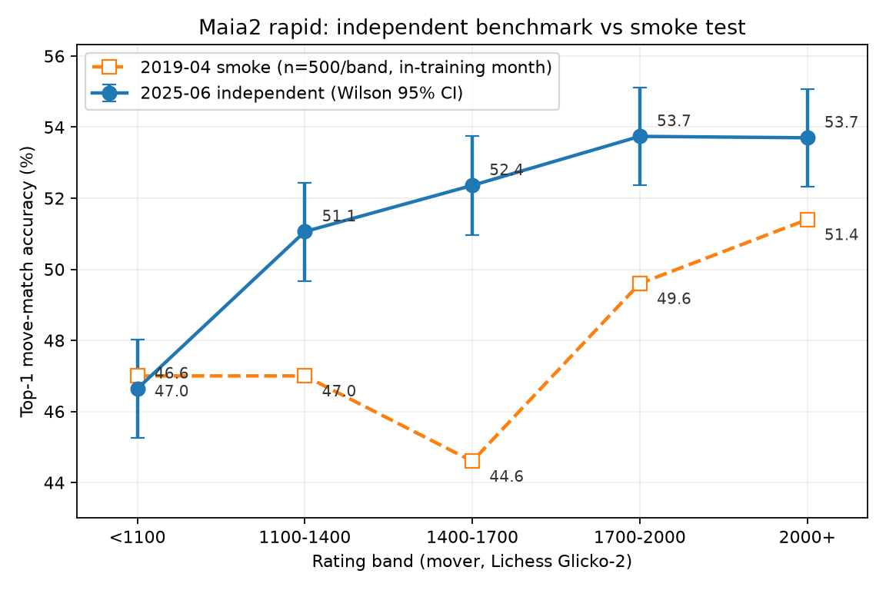
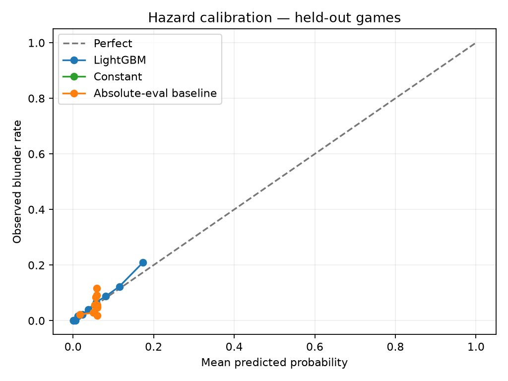
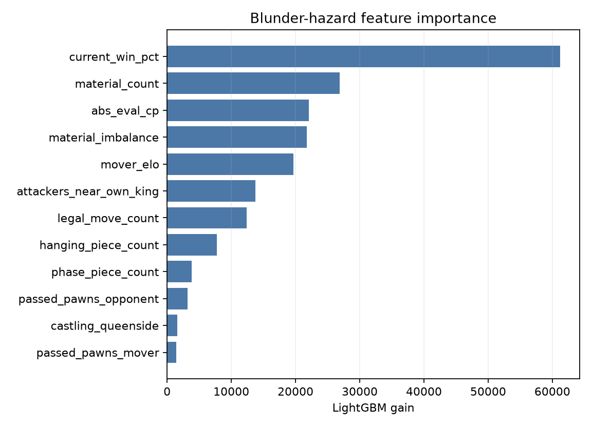

# Chess Coach Models

**Thesis: a chess coaching product cannot be built on engine output alone.**
Stockfish reports the objectively best move; coaching requires knowing whether
an opponent at a given rating will find the punishment, how likely the player
was to blunder *before* they moved, and which openings actually score for
humans at that level. This repository builds three Elo-conditioned models on
top of Stockfish and Maia2 and evaluates them with committed, reproducible
metrics. It makes four claims, each with its evidence in a section below:

1. **The human model transfers.** Maia2's Elo-conditioned move prediction
   holds up on a month of games it provably never trained on (§2).
2. **Blunder risk is predictable before the move** — and the engine evaluation
   used as a standalone ranking signal carries almost none of that
   predictability (§3).
3. **Opening value is population-dependent.** Lines the engine dislikes win
   at low ratings, and honest sample-size gates matter more than breadth (§4).
4. **Human concept vocabulary is decodable from the human model.** A small
   head on frozen Maia2 activations names tactical motifs far above chance
   (§5).

## Headline results

<!-- RESULTS_START -->
| Model | Result |
|---|---|
| Graded-opponent scorer | Maia2 smoke on 2,500 held-out positions; sample PGN annotation complete |
| Maia2 independent benchmark | Top-1 51.5% (95% CI 50.9–52.1%) on 25,000 2025-06 rated rapid moves |
| Blunder hazard v0 | PR-AUC 0.197 vs absolute-eval baseline 0.055; Brier 0.049 |
| Repertoire optimizer | 7 strict-N rows below 1100; 12 at 1100–1400 |
| Concept tagger | Macro-AP 0.469 vs prevalence baseline 0.047 across 35 puzzle themes |
<!-- RESULTS_END -->

Every number in this document is read from a committed artifact under
[`reports/`](reports/); `make reports` regenerates this table and all report
pages from those artifacts.

## 1. Data, labels, and protocol

Training and the committed evaluations use the
[Lichess Open Database](https://database.lichess.org/) (CC0), April 2019, via
a single seeded stream that is terminated at configured caps — the 9.87 GB
archive is never stored. The committed run recorded 300,039 games read,
300,000 opening games and 19,554 eval-annotated games retained, and 50,000
labeled positions drawn by seeded reservoir sampling from 1,202,165 eligible
adjacent-eval positions, with zero parse errors. The deployed platform reads
chess.com Published-Data PGNs at runtime; those contain no engine evals and a
different clock format, so runtime positions are scored by Stockfish directly.

Labels use Lichess's published win-probability conversion with centipawns
clamped to ±1000 and mate mapped to ±10000:

```text
Win% = 50 + 50 * (2 / (1 + exp(-0.00368208 * cp)) - 1)
```

Move quality is Win% before minus Win% after from the mover's perspective
(evals are always White-perspective; the code flips for Black, and tests cover
it). A blunder loses **more than 20 Win%**. Labels are only formed from
*adjacent* eval annotations — an eval gap never bridges two human moves.
Train/validation/test splits hash whole game IDs within rating-band strata, so
a game can never leak positions across splits.

Rating bands are `<1100`, `1100–1400`, `1400–1700`, `1700–2000`, `2000+` in
Lichess Glicko-2, which runs roughly 200–400 points above chess.com at the low
end. That mapping is documented as an assumption, not solved (§5).

## 2. Claim 1 — the human model transfers

The product leans on Maia2 for "will a player at this rating find this move?",
so the first thing to establish is that Maia2's published accuracy is real on
data it cannot have memorized. The released `rapid` weights were trained on
Lichess rapid games from May 2018 through November 2023 (excluding December
2019) and frozen in October 2024; the benchmark therefore samples **June
2025** — 25,000 moves, 5,000 per band, using the published Maia evaluation
filters (first 10 plies excluded, positions with either player under 30
seconds excluded, rated rapid only, no bots, ≤8 moves per player-game).



| Band | Moves | Top-1 accuracy | Wilson 95% CI |
|---|---:|---:|---|
| <1100 | 5,000 | 46.6% | 45.3–48.0% |
| 1100–1400 | 5,000 | 51.1% | 49.7–52.4% |
| 1400–1700 | 5,000 | 52.4% | 51.0–53.7% |
| 1700–2000 | 5,000 | 53.7% | 52.4–55.1% |
| 2000+ | 5,000 | 53.7% | 52.3–55.1% |
| **Overall** | **25,000** | **51.5%** | 50.9–52.1% |

**Analysis.** Regrouped into the Maia2 paper's skill bins, the accuracies land
within ~2 points of the published Cross-skill figures (49.6/53.6/53.7 vs
51.72/54.15/53.87), so the integration reproduces the paper's behavior rather
than a degraded copy of it. The earlier 2,500-move smoke test (charted above
in orange) had suggested a worrying non-monotonic dip at 1400–1700; the
independent benchmark shows that dip was an artifact of the smoke protocol —
eval-annotated games only, opening plies included, no clock filter — and its
±4.4 pp per-band noise. The real trend rises through the middle bands and
plateaus above 1700; only `<1100` vs `1100–1400` is separated at the 95%
level. One caution stands: Maia2's mean top-1 confidence exceeds its measured
accuracy by 3–4 points in every band
([#7](https://github.com/Aneesh-Pothuru/chess-coach-models/issues/7)), so the
product treats its probabilities as rankings, not calibrated chances. Full
protocol and cluster-bootstrap intervals:
[reports/maia_benchmark.md](reports/maia_benchmark.md).

The graded-opponent scorer builds directly on this: Stockfish MultiPV 3 finds
moves losing more than 10 Win%, and Maia2 reports the probability that the
best refutation is found at the player's band and at band +200. Sample
annotated games: [reports/graded_opponent.md](reports/graded_opponent.md).

## 3. Claim 2 — blunder risk is predictable before the move

`hazard(fen, elo) → probability` must answer "how dangerous is this position
for this player?" *before* the move is made. The shipped v0 is a
class-balanced LightGBM over hand-engineered features (material, phase,
checks, mobility, hanging-piece proxy, passed pawns, king pressure, castling
rights, rating, current eval), trained on 50,000 positions from 17,264 games
and calibrated by a Platt layer fit only on validation games.

| Band | N (test) | Base rate | ROC-AUC | PR-AUC | PR-AUC, abs-eval baseline | Brier |
|---|---:|---:|---:|---:|---:|---:|
| <1100 | 842 | 9.1% | 0.839 | 0.303 | 0.106 | 0.073 |
| 1100–1400 | 2,089 | 6.7% | 0.787 | 0.177 | 0.074 | 0.059 |
| 1400–1700 | 2,448 | 5.4% | 0.805 | 0.199 | 0.050 | 0.048 |
| 1700–2000 | 1,557 | 4.1% | 0.834 | 0.160 | 0.038 | 0.037 |
| 2000+ | 713 | 2.8% | 0.774 | 0.091 | 0.035 | 0.027 |
| **Overall** | **7,649** | **5.7%** | **0.817** | **0.197** | **0.055** | **0.049** |





**Analysis.** The success bar — beat the absolute-eval baseline on PR-AUC —
is passed by a factor of 3.6 (0.197 vs 0.055). The baseline's ROC-AUC of
0.502 is the sharpest statement of the thesis: ranking positions by |eval|
alone is no better than chance at predicting an upcoming blunder. The eval is
not useless — the learned model's highest-gain feature is the current win
probability — but it only becomes predictive in interaction with material,
phase, and rating context, which is exactly what a learned hazard model adds
over raw engine output. The calibration plot shows predicted probabilities
tracking observed blunder rates across the probability range, which is what
makes the output usable as a number rather than a score. A controlled v1
experiment added Maia2-derived features (policy entropy, top-1 probability,
P(best move | Maia2)) on a matched 5,000-position subset: PR-AUC 0.224 vs
0.213 for hand features alone. That +0.011 does not justify a Torch dependency
at runtime, so v0 remains the product model — a deliberate scope decision, not
an omission. Full tables: [reports/blunder_hazard.md](reports/blunder_hazard.md).

## 4. Claim 3 — opening value is Elo-conditioned

The repertoire optimizer aggregates the first 12 plies of 300,000 rated games
into an opening tree keyed by move prefix, storing N, score, Wilson 95% CI,
popularity, continuations, early trap density (from eval-annotated games
only), and Maia2 findability of the critical line for the target band.
Recommendations never relax the N≥2,000 gate: the committed run yields 7
qualifying lines below 1100 and 12 at 1100–1400, and sections honestly show
fewer than five rows where the capped sample cannot support more.

**Analysis.** The population effect the thesis predicts shows up directly in
the committed run. Below 1100, **Queen's Gambit Refused: Marshall Defense**
scores +10.9 points above the band average (N=128) while its eight-ply line
evaluates at −5 cp — an engine-neutral line that wins because of how humans
misplay it. At 1100–1400, **King's Gambit Accepted: Schallopp Defense**
scores +13.8 points above average (N=72) at −60 cp for White: the engine
mildly dislikes it and it wins anyway. Engine-approved advice would never
surface either line for these bands. The strongest strict-N lines are
conventional (1.e4 e5 2.Nf3 at 50.9%, N=5,326 below 1100; 1.d4 d5 2.c4 at
54.3%, N=3,309 at 1100–1400), which is itself a useful sanity check — the
model is not gambit-crazed, it simply refuses to pretend the engine's
preferences describe sub-1400 outcomes. Full tables:
[reports/repertoire_lt1100.md](reports/repertoire_lt1100.md),
[reports/repertoire_1100-1400.md](reports/repertoire_1100-1400.md).

## 5. Claim 4 — concepts are decodable from the human model

Coaching needs names: "you missed a *fork*" travels, a centipawn delta does
not. The concept tagger is a 1024→256→35 multi-label head on frozen Maia2
`last_ln` activations, supervised by Lichess puzzle themes: 100,000 puzzles
sampled uniformly from 3.3M eligible rows (≥200 plays), with the setup move
applied so the tagged position is the one the solver actually faces, and
splits grouped by source game.


On 14,881 held-out positions, macro average precision is **0.469** against a
prevalence baseline of 0.047 — a 10× lift — and micro-AP is **0.638**. All 35
themes score at least twice their prevalence.

**Analysis.** What the head finds easy and hard is itself evidence about the
encoder. Endgame types are nearly solved (pawnEndgame AP 0.995, rookEndgame
0.931) — material signatures are trivially present in the representation.
Named mate patterns decode strongly despite rarity (backRankMate 0.773,
smotheredMate 0.769 at 0.6% prevalence — a 126× lift), and `mate` itself
reaches 0.897: the human model's representation knows when a king hunt is on.
The hardest themes are the relational ones — deflection (0.174), clearance
(0.070), capturingDefender (0.121) — motifs defined by *why* a move works
rather than by what the board looks like. That gradient matches the spec's
caveat: puzzle themes carry tactical vocabulary well, and positional concepts
will need the probe-reuse path (the CSSLab maia2 repo ships Elo-conditioned
linear probes over 172 formal concepts) or new annotation. Product surface:
`concepts(fen)` plus `scripts/tag_concepts.py`; on the position before
Scholar's mate, the tagger returns `mate` 1.00 and `attackingF2F7` 0.99.
Full per-theme table: [reports/concept_tagger.md](reports/concept_tagger.md).

## 6. Is this usable in a product today?

| Model | Verdict | What it needs before full deployment |
|---|---|---|
| Blunder hazard v0 | **Yes**, behind a Lichess-rating interface | chess.com recalibration and rating mapping ([#2](https://github.com/Aneesh-Pothuru/chess-coach-models/issues/2)) |
| Graded-opponent scorer | **Yes**, for offline/batch annotation | Maia2 probability calibration for absolute numbers ([#7](https://github.com/Aneesh-Pothuru/chess-coach-models/issues/7)) |
| Repertoire optimizer | **Partially** — `<1100` and `1100–1400` only | Production-scale sample for upper bands and deeper lines ([#3](https://github.com/Aneesh-Pothuru/chess-coach-models/issues/3)) |
| Concept tagger | **Yes**, for tactical vocabulary | Positional concepts via probe reuse or annotation; quiet-position validation |

The hazard model is the closest to product-ready: it is a small joblib
artifact with no Torch dependency, its ranking quality clearly beats the
engine-only alternative, and its probabilities are calibrated on held-out
games. The scorer runs today as a batch annotator (Stockfish plus two Maia2
lookups per candidate move, CPU-viable); its punishment probabilities are now
independently validated but should be consumed as rankings until #7 lands.
The repertoire optimizer is trustworthy precisely where it has data — it
refuses to recommend beyond its sample, so upper bands need the scaled run.
The concept tagger can label tactical moments in user games today (its worst
theme still doubles chance), but it was trained on tactics-dense puzzle
positions, so its behavior on quiet positions is extrapolation until
validated — and positional vocabulary is not in its label set at all.
The one assumption that gates *all three* for the chess.com deployment is the
rating mapping: every model is conditioned on Lichess Glicko-2, and the
200–400 point low-end offset is documented but unvalidated until
[#2](https://github.com/Aneesh-Pothuru/chess-coach-models/issues/2) is done.

## 7. Reproduce from a fresh clone

Prerequisites: macOS or Linux, Python 3.11–3.13, `zstd`, and Stockfish. Apple
Silicon is the reference environment; the pipeline also runs on commodity
Linux CPU (the 2025-06 benchmark was produced on 4 cores). The committed
batch eval pins Maia2 to CPU: MPS worked interactively but segfaulted on the
5,000-position batch. Evaluation stages run in isolated Python processes
because mixing LightGBM's OpenMP pool and Torch inference in one process can
stall on macOS. Both workarounds preserve the configured sample sizes.

```bash
brew install zstd stockfish   # or apt-get install zstd stockfish
make setup
make test
make data        # stream Lichess 2019-04, stop at configured caps
make eval        # train + evaluate all three models
make reports     # regenerate reports/ and this README's results table
make benchmark   # independent Maia2 benchmark on the configured 2025-06 month
make concepts    # stream the puzzle DB, train and evaluate the concept tagger
```

All tunables live in [`configs/config.yaml`](configs/config.yaml): source
months, rating bands, sample caps, thresholds, Stockfish budget, device
choices. Useful direct commands:

```bash
.venv/bin/python scripts/score_pgn.py my_games.pgn --output scored.json
.venv/bin/python scripts/mine_hazard.py --fen "$FEN" --elo 1250
.venv/bin/python scripts/mine_hazard.py --pgn my_games.pgn --top-n 20
.venv/bin/python scripts/build_repertoire.py --query-pgn my_games.pgn \
  --band 1100-1400 --perspective white
```

Downloaded PGNs, Parquet datasets, Maia2 weights, and trained binaries are
gitignored; reports, plots, metrics JSON, code, config, and tiny PGN fixtures
are committed. 29 pytest tests cover mate parsing, Black-side flips, clocks,
labels, splits, features, Wilson intervals, opening-tree counts, the
benchmark's protocol filters, and the puzzle semantics and head training of
the concept tagger.

## Data and software licenses

- [Lichess Open Database](https://database.lichess.org/) exports are **CC0**.
- [`maia2`](https://pypi.org/project/maia2/) is MIT-licensed; weights download
  locally on first use. Original Maia-1 weights are GPL and are not used here.
- This repository's code is MIT-licensed.

## Limitations and open threads

- Eval-annotated Lichess games are not a random sample of all play; hazard
  results characterize the sampled annotated population.
- The committed run is laptop-sized; config scales unchanged on a larger box
  ([#3](https://github.com/Aneesh-Pothuru/chess-coach-models/issues/3)).
- The independent benchmark samples the first hours of June 1, 2025
  ([#8](https://github.com/Aneesh-Pothuru/chess-coach-models/issues/8) tracks
  multi-offset sampling).
- The hanging-piece feature is a fast SEE proxy, not a full exchange search
  ([#5](https://github.com/Aneesh-Pothuru/chess-coach-models/issues/5)).
- chess.com recalibration is required before deployment claims
  ([#2](https://github.com/Aneesh-Pothuru/chess-coach-models/issues/2));
  Maia2 MPS batch stability is tracked in
  ([#6](https://github.com/Aneesh-Pothuru/chess-coach-models/issues/6)); the
  neural hazard head remains deferred until it can beat LightGBM on an
  independent sample ([#4](https://github.com/Aneesh-Pothuru/chess-coach-models/issues/4)).
