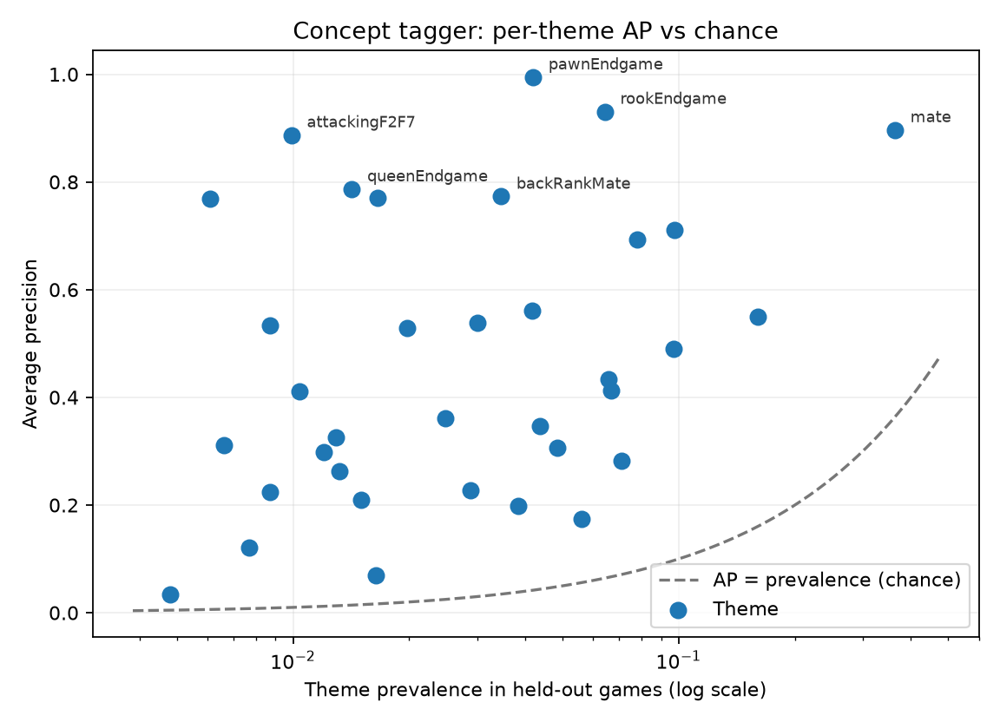

# Model 6: Concept tagger

A multi-label head (1024→256→35) on frozen `maia2-rapid last_ln (frozen)` activations, supervised by Lichess puzzle themes. Trained on 100,000 puzzles sampled uniformly from 3,302,205 eligible rows (≥200 plays); splits are grouped by source game.

## Held-out results

- Macro average precision **0.469** vs prevalence baseline 0.047.
- Micro average precision **0.637** vs baseline 0.047.
- 35 of 35 themes score at least 2× their prevalence on 14,881 held-out positions from 14,881 games.

## Per-theme detail

| Theme | Positives | Prevalence | AP | Lift |
|---|---:|---:|---:|---:|
| mate | 5,410 | 36.4% | 0.897 | 2.5× |
| fork | 2,392 | 16.1% | 0.550 | 3.4× |
| kingsideAttack | 1,454 | 9.8% | 0.711 | 7.3× |
| sacrifice | 1,442 | 9.7% | 0.489 | 5.0× |
| advancedPawn | 1,159 | 7.8% | 0.694 | 8.9× |
| pin | 1,059 | 7.1% | 0.282 | 4.0× |
| defensiveMove | 994 | 6.7% | 0.413 | 6.2× |
| discoveredAttack | 979 | 6.6% | 0.433 | 6.6× |
| rookEndgame | 957 | 6.4% | 0.931 | 14.5× |
| deflection | 835 | 5.6% | 0.174 | 3.1× |
| attraction | 722 | 4.9% | 0.306 | 6.3× |
| quietMove | 650 | 4.4% | 0.346 | 7.9× |
| pawnEndgame | 623 | 4.2% | 0.995 | 23.8× |
| hangingPiece | 619 | 4.2% | 0.562 | 13.5× |
| exposedKing | 572 | 3.8% | 0.198 | 5.1× |
| backRankMate | 515 | 3.5% | 0.773 | 22.3× |
| promotion | 447 | 3.0% | 0.538 | 17.9× |
| skewer | 430 | 2.9% | 0.228 | 7.9× |
| discoveredCheck | 369 | 2.5% | 0.361 | 14.5× |
| queensideAttack | 295 | 2.0% | 0.529 | 26.7× |
| bishopEndgame | 247 | 1.7% | 0.771 | 46.5× |
| clearance | 244 | 1.6% | 0.070 | 4.2× |
| intermezzo | 223 | 1.5% | 0.209 | 14.0× |
| queenEndgame | 211 | 1.4% | 0.787 | 55.5× |
| operaMate | 197 | 1.3% | 0.263 | 19.9× |
| trappedPiece | 192 | 1.3% | 0.326 | 25.2× |
| pillsburysMate | 178 | 1.2% | 0.298 | 24.9× |
| zugzwang | 155 | 1.0% | 0.411 | 39.4× |
| attackingF2F7 | 148 | 1.0% | 0.887 | 89.2× |
| knightEndgame | 130 | 0.9% | 0.533 | 61.0× |
| queenRookEndgame | 130 | 0.9% | 0.224 | 25.6× |
| capturingDefender | 115 | 0.8% | 0.121 | 15.6× |
| doubleCheck | 98 | 0.7% | 0.312 | 47.4× |
| smotheredMate | 91 | 0.6% | 0.769 | 125.7× |
| epauletteMate | 72 | 0.5% | 0.034 | 6.9× |

## Protocol notes and limitations

- The tagged position is the puzzle FEN with the setup move applied — the position the solver actually faces.
- Embeddings are Maia2 `last_ln` activations conditioned at a fixed 1500 Elo, so tags are rating-independent.
- Excluded meta-themes (length, phase, eval-derived outcome): master, masterVsMaster, oneMove, short, long, veryLong, opening, middlegame, endgame, crushing, advantage, equality, mateIn1, mateIn2, mateIn3, mateIn4, mateIn5.
- Puzzle themes cover tactical vocabulary; positional concepts (outposts, bad bishops, pawn breaks) are not represented in this supervision and need the probe-reuse path (CSSLab maia2 repo, 172 formal concepts) or extra annotation.
- Puzzle positions are tactics-dense by construction; deployment on quiet game positions extrapolates beyond this distribution.
